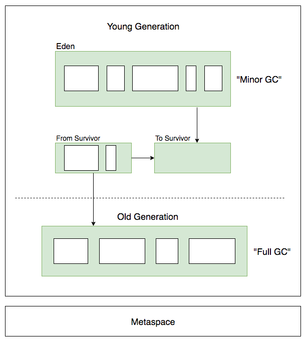

## 垃圾收集是什么

> Automatic garbage collection is the process of looking at heap memory, identifying which objects are in use and which are not, and deleting the unused objects. An in use object, or a referenced object, means that some part of your program still maintains a pointer to that object. An unused object, or unreferenced object, is no longer referenced by any part of your program. So the memory used by an unreferenced object can be reclaimed.

- GC是一个自动的过程，它是一个低优先级的守护进程。
- GC收集的所谓垃圾指的是不可用对象，即不被程序中任何对象引用的对象，其所占据的堆空间可以被回收。

## 按代回收机制

### Young Generation

- 新生代用来保存那些第一次被创建的对象，它被分为一个Eden空间和两个Survivor空间。
- 绝大多数新创建的对象会存放于Eden空间；Eden每执行一次Minor GC后，存活的对象会被移动到其中一个Survivor空间（暂且称为S1）并不断在此空间中堆积直至空间饱和；S1空间饱和后，还存活的对象会被移动到另一个Survivor空间（暂且称为S2），并清空S1空间；按此步骤重复几次后依然存活的对象会被移动到老年代。

### Old/Tenured Generation

- 老年代用来保存那些长期存活的对象，即从新生代GC中存活下来的对象。
- 老年代空间的Full GC事件基本上是在空间已满时发生，执行的过程根据GC类型的不同而不同。

### Metaspace

- Metaspace存放类加载信息、编译后的代码等。

## 垃圾回收类型

##参考资料

- [Java Garbage Collection Basic][1]
- [Java SE HotSpot at a Glance][2]
- [《深入理解Java虚拟机:JVM高级特性与最佳实践（第2版）》][3]

[1]: https://www.oracle.com/webfolder/technetwork/tutorials/obe/java/gc01/index.html
[2]: https://www.oracle.com/technetwork/java/javase/tech/index-jsp-136373.html
[3]: https://www.amazon.cn/%E5%9B%BE%E4%B9%A6/dp/B00D2ID4PK/ref=sr_1_1?ie=UTF8&qid=1490516490&sr=8-1&keywords=%E6%B7%B1%E5%85%A5%E7%90%86%E8%A7%A3java%E8%99%9A%E6%8B%9F%E6%9C%BA