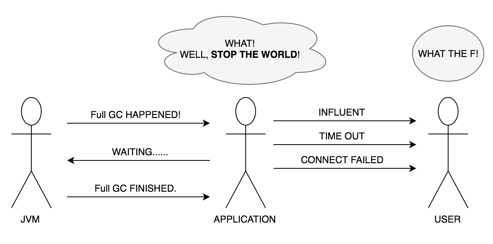

## 为什么需要优化GC

> 最重要的目的：最小化Minor/Full GC的执行时间




## 什么时候需要优化GC

> “GC优化永远是最后一项工作”

- 前端停顿现象明显：应用卡顿、不流畅等
- 系统充斥着大量的超时日志
- 没有设置内存大小等基本参数


## GC优化的基本过程

- 监控GC状态
- 分析监控结果，决定是否需要进行优化
- 调整GC类型、内存空间等
- 调整参数并持续收集数据，对比分析结果
- 如果结果令人满意，可将参数应用于所有服务器，并结束优化


## 如何监控GC状态

### GC实时监控工具

- jcmd / jps
- jstat
- jinfo
- jvisualvm + Visual GC

### GC Log

#### 1. 相关JVM参数

```
-verbose:gc
-XX:+PrintGCDateStamps
-XX:+PrintGCDetails
-Xloggc:<file-path>
```

#### 2. Log分析工具

- HP Jmeter
- gceasy.io


## 参考资料

- [《深入理解Java虚拟机:JVM高级特性与最佳实践（第2版）》][1]

[1]: https://www.amazon.cn/%E5%9B%BE%E4%B9%A6/dp/B00D2ID4PK/ref=sr_1_1?ie=UTF8&qid=1490516490&sr=8-1&keywords=%E6%B7%B1%E5%85%A5%E7%90%86%E8%A7%A3java%E8%99%9A%E6%8B%9F%E6%9C%BA